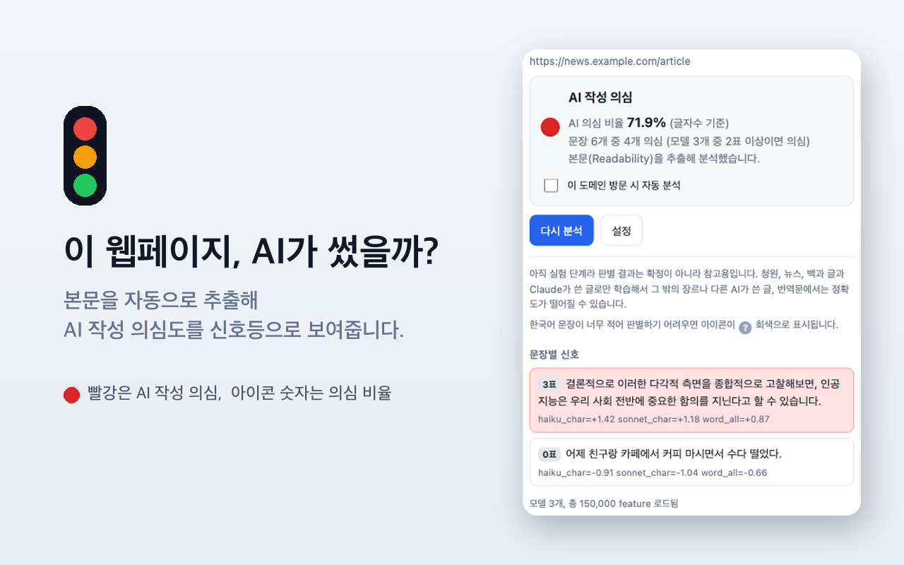

# 한국어 AI 글 판별기 (신호등) — 크롬 확장

웹페이지의 한국어 본문을 추출해 AI가 썼을 가능성을 통계적으로 추정하고,
결과를 **툴바 아이콘 신호등**으로 보여주는 Manifest V3 크롬 확장입니다.
[상위 저장소](../)의 판별기(`app.js` / `model.json`)를 브라우저 확장으로 감쌌습니다.

- 🟢 사람 작성 추정, 🟡 판단 보류(혼재), 🔴 AI 작성 의심, ⚪ 판별 불가
- 아이콘 위 숫자는 AI 의심 비율(%). 아이콘을 누르면 사이드 패널에 문장별 상세.
- **분석은 100% 브라우저 안에서** 돕니다. 페이지 내용, 주소, 결과를 외부로 전송하지 않습니다. 서버도 계정도 필요 없습니다.

## 설치

### 방법 A — Chrome 웹스토어 (심사 중)
심사가 끝나면 여기에 링크를 올립니다.

### 방법 B — 지금 바로 (개발자 모드)
1. 이 저장소 [Releases](../../../releases)에서 `ko-ai-detector-*.zip`을 받아 압축을 풀거나, `extension/` 폴더를 통째로 내려받습니다.
2. `chrome://extensions` 접속 → 우상단 **개발자 모드** 켜기.
3. **압축해제된 확장 프로그램을 로드** → 위 폴더 선택.
4. 아무 한국어 기사에서 툴바의 확장 아이콘을 누르면 사이드 패널이 열리며 분석합니다.

## 사용법

- **수동**: 어느 페이지든 아이콘 클릭 → 사이드 패널이 열리며 그 페이지를 분석.
- **자동**: 사이드 패널의 "이 도메인 방문 시 자동 분석" 토글, 또는 설정에서 도메인을 등록하면 그 도메인에 한해 방문 시 자동 분석(그 도메인 권한을 그때 요청).
- **선택 분석**: 페이지에서 문장을 드래그로 선택한 뒤 분석하면 그 부분만 채점합니다.

## 어떻게 동작하나

문서를 문장 단위로 나눈 뒤, 문자 단위와 단어 단위의 여러 선형 SVM 모델이 투표해
의심 문장을 가려내고, 글자 수를 기준으로 전체 AI 의심 비율을 계산합니다. 본문
추출에는 Mozilla Readability를 사용해 메뉴나 광고 같은 부분을 걸러냅니다. 추론
코드와 모델(`model.json`)은 모두 확장 안에 포함되어 있어 외부 코드를 실행하지 않습니다.

## 권한

- `activeTab` + `scripting`: 아이콘을 눌렀을 때만 현재 탭에 추출 코드를 주입하고, 자동 분석을 켠 도메인에만 콘텐츠 스크립트를 등록합니다. 설치 시 전체 사이트 권한을 요구하지 않습니다.
- `storage`: 자동 분석 도메인 목록 등 설정 저장.
- `sidePanel`: 문장별 상세 표시.
- `tabs` 권한은 쓰지 않습니다(브라우징 기록 읽기 경고 없음).

## 개인정보

모든 분석은 기기 안에서만 수행되며, 페이지 내용이나 주소를 외부로 보내지 않습니다.
[개인정보처리방침](https://jadhvank.github.io/ko-llm-classifier/privacy.html)

## 한계 (꼭 읽어주세요)

이 도구는 AI 작성 여부를 **확정하는 것이 아니라 통계적으로 추정**해 참고용으로 보여줍니다.
학습에 쓴 글이 청원, 뉴스, 백과 종류와 특정 AI가 쓴 글에 한정돼 있어, 그 밖의 장르나
다른 AI가 쓴 글, 번역문에서는 정확도가 떨어질 수 있습니다. 채용, 학사, 징계 같은 중요한
판단의 단독 근거로 사용하지 마세요.

## 크레딧 / 라이선스

- 판별 방법 원안: lyc8503, [고전 머신러닝으로 LLM 생성 텍스트 탐지](https://blog.lyc8503.net/post/llm-classifier/)
- 본문 추출: Mozilla [Readability](https://github.com/mozilla/readability) (Apache-2.0, `vendor/Readability.js`에 원본 라이선스 헤더 보존)
- 그 외 코드: [MIT](../LICENSE)

만든 게 도움이 되셨다면 ☕ [개발자에게 커피 한 잔](https://ko-fi.com/jadhvank)
